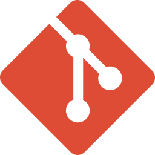

# Hey I'm Ayush Raj 👋🏻

## About Me

I'm a self-taught software engineer specializing in performant, scalable web development. With expertise in Front-end and Back-end, I build clean, maintainable applications while optimizing performance. With a strong interest in artificial intelligence, I’m driven to bridge theoretical knowledge with practical solutions that address real-world problems. My learning journey is fueled by curiosity, creativity, and a desire to make an impact through meaningful projects. I’m always learning, exploring new patterns, and refining my approach to modern web development.

## 🛠️ Technologies & Tools

### Languages

  
  
  
  
  

### Front-end Frameworks

  
  
  
  

### Version Control

  
  

### Other Tools

 
  
  

